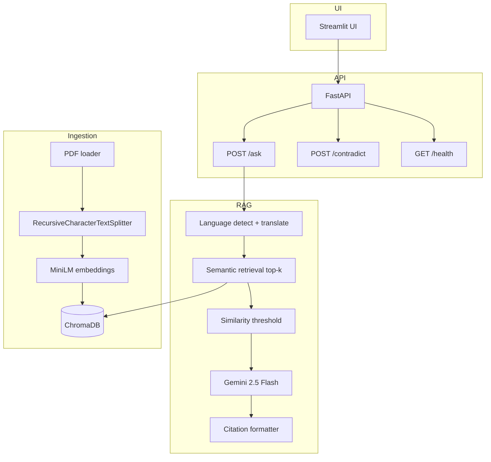

# potens-intern-aiml-techiekrish

**Document Q&A with Citations** — A focused, production-aware RAG system for the Potens IT Services AI/ML Engineer Internship take-home.

Built for **reliability**, **grounded answers**, and **retrieval transparency** — not feature breadth.

---

## Project Overview

This repository implements a trustworthy retrieval-augmented generation (RAG) pipeline over company policy documents. The system:

- Answers questions in **English, Hindi, Gujarati, and Marathi** (response in the query language)
- Returns **grounded answers** with explicit citations
- **Refuses** when evidence is weak (anti-hallucination)
- Exposes **retrieval debug** data (chunks, similarity scores, sources)
- Supports **contradiction analysis** between two documents on a topic

**Design intent:** Demonstrate engineering judgment under realistic time constraints — a dependable pipeline reviewers can trust, not a tutorial stack with every optional module enabled.

---

## Features

| Capability | Implementation |
|------------|----------------|
| Ingestion | PDF load, recursive chunking, metadata preservation |
| Retrieval | ChromaDB + `paraphrase-multilingual-MiniLM-L12-v2` |
| Generation | Gemini 2.5 Flash with strict context-only prompts |
| Citations | Source file, page, chunk ID, supporting snippet |
| Safety | Similarity threshold + insufficient-information refusal |
| API | FastAPI (`/ask`, `/contradict`, `/health`, ingest) |
| UI | Streamlit with retrieval debug panel |
| Evaluation | 10-question dataset + metrics script |

**Intentionally not implemented:** reranking, hybrid BM25 + vector search, OCR, agents, Redis, Docker, auth, cloud deployment.

---

## Architecture



---

## Folder Structure

```
project-root/
├── app/
│   ├── api/              # FastAPI routes and schemas
│   ├── rag/              # Embeddings, ChromaDB, retrieval, scoring
│   ├── ingestion/        # PDF load, chunking, pipeline
│   ├── evaluation/       # Dataset and eval script
│   ├── prompts/          # Grounded and contradiction prompts
│   ├── utils/            # Config, logging, citations
│   └── services/         # QA, LLM, language, contradiction
├── documents/            # PDF corpus (sample policies + optional uploads)
├── chroma_db/            # Persistent vectors (generated locally)
├── streamlit_app/        # Streamlit UI
├── scripts/              # Sample PDF generator, Windows setup helper
├── tests/
├── examples/
├── main.py
├── requirements.txt
├── .env.example
├── AI_USE_LOG.md
└── README.md
```

---

## Setup Instructions

**Prerequisites:** Python 3.10+, [Gemini API key](https://aistudio.google.com/apikey)

```bash
git clone https://github.com/<your-username>/potens-intern-aiml-techiekrish.git
cd potens-intern-aiml-techiekrish

python -m venv .venv
# Windows:  .venv\Scripts\activate
# macOS/Linux:  source .venv/bin/activate

pip install -r requirements.txt

copy .env.example .env    # Windows
# cp .env.example .env    # macOS/Linux
# Set GEMINI_API_KEY in .env

python scripts/generate_sample_documents.py

python main.py
# New terminal:
streamlit run streamlit_app/app.py
```

**Windows helper:** `.\scripts\run_setup.ps1`

**Expected setup time:** Under 10 minutes after dependencies are cached (first embedding model download ~400MB).

### Troubleshooting (Windows)

If ChromaDB or ONNX fails on import, use a **fresh venv** with Python 3.10/3.11, or run under **WSL2**. Large wheels (`torch`, `chromadb`) can take 10–20 minutes to install with little console output — that is normal.

---

## API Endpoints

### `GET /health`

Returns API status and indexed chunk count.

### `POST /ask`

**Request**
```json
{ "question": "How many days of annual leave are provided?" }
```

**Response**
```json
{
  "answer": "...",
  "citations": [
    {
      "label": "[Source: leave_policy.pdf | Page 1 | Chunk abc_3]",
      "source_file": "leave_policy.pdf",
      "page_number": "1",
      "chunk_id": "abc_3",
      "snippet": "Full-time employees receive twenty (20) days..."
    }
  ],
  "confidence_score": 0.72,
  "retrieved_chunks": []
}
```

### `POST /contradict`

**Request**
```json
{
  "document_1": "leave_policy.pdf",
  "document_2": "hr_handbook_excerpt.pdf",
  "topic": "annual leave entitlement"
}
```

**Response**
```json
{
  "conflict": true,
  "reasoning": "Document A states 20 days while Document B states 18 days...",
  "evidence": []
}
```

### `POST /ingest` and `POST /ingest/upload`

Re-index all PDFs in `documents/` or upload a single PDF.

---

## Technology Choices

| Component | Choice | Why |
|-----------|--------|-----|
| Vector DB | **ChromaDB** | Lightweight persistent storage, minimal setup, metadata-friendly citations |
| LLM | **Gemini 2.5 Flash** | Fast inference, strong multilingual performance, practical free tier |
| Embeddings | **paraphrase-multilingual-MiniLM-L12-v2** | Cross-lingual semantic search; runs locally |
| Chunking | **RecursiveCharacterTextSplitter** | Overlapping recursive splits preserve semantic boundaries |
| Backend | **FastAPI** | Typed APIs, easy testing |
| UI | **Streamlit** | Professional UI without frontend boilerplate |

---

## Chunking Strategy

| Parameter | Value | Rationale |
|-----------|-------|-----------|
| `chunk_size` | 800 | Enough context for policy clauses; small enough for precise citations |
| `chunk_overlap` | 150 | ~19% overlap reduces information loss at split boundaries |

**Why this configuration:**

- **Semantic continuity** — overlap keeps sentences split across chunks recoverable
- **Retrieval quality** — chunk size tuned for embedding match specificity
- **Citation precision** — evidence maps cleanly to `source_file`, `page_number`, `chunk_id`
- **Context preservation** — recursive separators respect paragraphs and sentences

Every chunk stores metadata: `source_file`, `page_number`, `chunk_id`, `document_id`, `language`.

---

## Retrieval Strategy

1. Detect query language (`langdetect`)
2. Translate query to **English** for retrieval (translation boundary)
3. Embed with multilingual MiniLM; search ChromaDB (cosine, top-k = 5)
4. Drop chunks below similarity threshold (default **0.45**)
5. Build numbered context for the LLM
6. Generate answer in the **original query language**

**No reranking or hybrid BM25** — deliberate simplicity for a reliable 24-hour scope.

---

## Hallucination Prevention

| Layer | Mechanism |
|-------|-----------|
| Retrieval | Similarity threshold filters weak evidence |
| Prompting | Answer only from provided context; never invent facts |
| Refusal | Fixed insufficient-information message when evidence is inadequate |
| Confidence | Heuristic: 70% max similarity + 30% support ratio |
| UI | Low-confidence warning and retrieval debug panel |

**Refusal message:**

> *The provided documents do not contain enough information to answer this question confidently.*

---

## Multilingual Support

**Supported:** English (`en`), Hindi (`hi`), Gujarati (`gu`), Marathi (`mr`)

**Approach (intentionally simple):**

1. Detect query language  
2. Translate query to English for retrieval  
3. Generate the answer in the original language  

This **translation-boundary** design was chosen for reliability and speed within assignment constraints. Multilingual embeddings still help cross-lingual similarity; English retrieval queries keep policy-style search consistent when most source PDFs are in English.

---

## Evaluation Strategy

Dataset: `app/evaluation/eval_dataset.json` (10 questions with expected sources and keywords)

```bash
python -m app.evaluation.run_eval
```

**Metrics:**

- Retrieval hit rate (@top-5, expected source present)
- Keyword match rate in grounded answers
- Count of appropriate refusals

Results: `app/evaluation/eval_results.json` (gitignored).

---

## Tradeoffs

| Decision | Benefit | Cost |
|----------|---------|------|
| No reranking | Simpler, faster, easier to debug | Lower precision on ambiguous queries |
| No hybrid BM25 | Less infrastructure | Weaker exact keyword matching |
| Translation for retrieval | Stable English retrieval | Translation boundary errors |
| Heuristic confidence | Transparent, explainable | Not a calibrated probability |
| Local embeddings | No embedding API cost | First-run model download |
| ChromaDB (local) | Zero DevOps for take-home | Not production-scale alone |

---

## Limitations

- **No OCR** — scanned PDFs without a text layer will not index well  
- **Contradiction detection** may miss implicit semantic conflicts  
- **Confidence** is heuristic, not statistically calibrated  
- **Multilingual quality** depends on translation and LLM fluency  
- **PDF text extraction** varies by how the PDF was produced  
- **Network** required for Gemini API and Google Translate (`deep-translator`)

---

## Future Improvements

Documented only — not implemented in this submission:

- Cross-encoder reranking  
- Hybrid BM25 + vector retrieval  
- OCR for scanned documents  
- pgvector or managed vector DB  
- Streaming responses  
- Authentication and multi-tenant isolation  
- Production deployment with observability  

---

## Testing

```bash
pytest tests/ -v
```

Covers chunk metadata, citations, retrieval threshold, multilingual helpers, API health, and refusal handling.

---

## Logging

Structured logs via Python `logging`: queries, retrieval scores, chunk counts, latency, errors. Set `LOG_LEVEL` in `.env` (default: `INFO`).

---

## Suggested Commit History

```
initialize fastapi project structure
implement pdf ingestion pipeline
add chunk metadata preservation
integrate chromadb semantic retrieval
implement grounded answer prompting
add citation formatting system
implement multilingual translation flow
build streamlit retrieval debugging interface
add evaluation dataset and metrics
document architecture tradeoffs in README
```

---

## AI Use Log

See [AI_USE_LOG.md](AI_USE_LOG.md).

---

## Author

Krish Shah — Potens IT Services AI/ML Engineer Internship Take-Home
