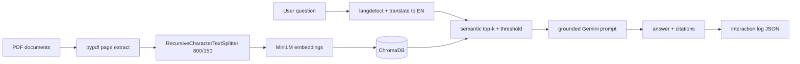

# potens-intern-aiml-krish-shah

**Document Q&A with Citations** — a focused RAG take-home for Potens IT Services (Problem Q1).

Design goal: a **trustworthy, grounded pipeline** with retrieval transparency — not feature breadth.

---

## What works today

| Area | Status |
|------|--------|
| PDF ingest → chunk → embed → ChromaDB | Working |
| `POST /ask` with citations + confidence | Working |
| `POST /contradict` with reasoning + evidence | Working |
| Multilingual queries (en/hi/gu/mr) → answer in same language | Working (translation boundary) |
| Similarity threshold + strict prompts + refusal | Working |
| Streamlit UI + full retrieval debug | Working |
| Runtime interaction log | Working (`evaluation/eval_dataset.json`) |

## What is incomplete or fragile

| Item | Notes |
|------|--------|
| **Automated labeled eval** | No `run_eval.py` with hit-rate metrics — manual benchmark + interaction log instead (time vs. quota tradeoff). |
| **Gujarati / Marathi** | Supported in code; less manually tested than English/Hindi. |
| **Contradiction on implicit conflicts** | LLM may miss subtle semantic clashes; works best on explicit numeric/policy conflicts. |
| **Windows + ChromaDB** | Some environments hit ONNX/access issues; WSL or Linux venv recommended. |
| **Corpus language** | PDFs are English-only; multilingual is query-time only. |
| **Gemini free tier** | Rate limits on heavy UI testing. |

---

## Quick start (< 10 minutes)

```bash
git clone https://github.com/krishshah1108/potens-intern-aiml-krish-shah.git
cd potens-intern-aiml-krish-shah
python -m venv .venv
.venv\Scripts\activate          # Windows
# source .venv/bin/activate   # Linux/macOS
pip install -r requirements.txt
copy .env.example .env          # set GEMINI_API_KEY
```

Terminal 1 — API:

```bash
python main.py
```

Terminal 2 — UI:

```bash
streamlit run streamlit_app/ui.py
```

On first run, ingest PDFs from `documents/` via Streamlit **Re-ingest all** or `POST /ingest`.

**Verify:** `GET http://localhost:8000/health` → `vector_store_chunks` > 0.

---

## Corpus (included)

Six English education policy/research PDFs (~10–15 pages each) in `documents/`:

| File | Role |
|------|------|
| `student_data_privacy_policy_2024.pdf` | SDP / penalties |
| `national_curriculum_framework_2023.pdf` | NCF structure |
| `learning_outcomes_study_rlos_phase2.pdf` | RLOS Phase II study |
| `online_education_effectiveness_dli_2024.pdf` | DLI evaluation |
| `stem_curriculum_evaluation_framework2022.pdf` | STEM fidelity |
| `teacher_training_certification_guidelines_2024.pdf` | TTC certification |

**Manual test plan:** `examples/education_sample_questions.md` (20 questions + 4 contradiction pairs).  
**Benchmark checklist:** `evaluation/manual_benchmark.json` (10 items for quick judge-style checks).

---

## Architecture



**Modules**

- `app/ingestion/` — PDF load, chunking, ingest pipeline  
- `app/rag/` — embeddings, ChromaDB, retrieval, scoring  
- `app/services/` — QA orchestration, LLM, language, contradiction  
- `app/prompts/` — grounded + contradiction templates  
- `app/api/` — FastAPI routes  
- `streamlit_app/ui.py` — UI (calls API; avoids naming clash with `app/` package)

---

## Folder structure

```
├── app/
│   ├── api/              # FastAPI routes
│   ├── rag/              # Embeddings, ChromaDB, retrieval
│   ├── ingestion/        # PDF load, chunking, pipeline
│   ├── evaluation/       # interaction_log.py
│   ├── prompts/
│   ├── utils/
│   └── services/
├── documents/            # PDF corpus
├── evaluation/
│   ├── eval_dataset.json       # runtime Q&A traces (gitignored)
│   └── manual_benchmark.json   # 10 manual test cases
├── examples/
├── streamlit_app/ui.py
├── main.py
└── README.md
```

---

## Chunking strategy (800 / 150)

`RecursiveCharacterTextSplitter` with `chunk_size=800`, `chunk_overlap=150`:

- **Semantic continuity** — splits on paragraphs/sentences before hard cuts.  
- **Retrieval quality** — chunks large enough to hold a policy clause or table row context.  
- **Citation precision** — overlap reduces answers that span a boundary without retrieval support.  
- **Metadata** — every chunk stores `source_file`, `page_number`, `chunk_id`, `document_id`, `language` (corpus tagged `en`).

Chunk text is prefixed with `Source: {file} | page {n}` so embeddings and citations stay aligned.

---

## Retrieval strategy

1. Detect query language → translate to English for retrieval (documents are English).  
2. Embed query with `paraphrase-multilingual-MiniLM-L12-v2`.  
3. Fetch `retrieval_candidates` (25) from ChromaDB, keep top `top_k` (8).  
4. Filter by `similarity_threshold` (0.45, cosine similarity `1 - distance`).  
5. If **no chunks pass threshold** → return fixed insufficient-information message (**no LLM call**).

Confidence heuristic: `0.7 * max(similarity) + 0.3 * (fraction above threshold)`.

---

## Hallucination prevention

- Threshold gate before LLM  
- System prompt: context-only, exact refusal string when unsupported  
- Citations built only from chunks sent to the model  
- Streamlit shows all retrieved chunks, scores, and threshold flags  

Refusal text:

> The provided documents do not contain enough information to answer this question confidently.

---

## Multilingual support

Supported query languages: **English, Hindi, Gujarati, Marathi**.

Flow (intentionally simple):

1. `langdetect` on the question  
2. Translate query to English (`deep-translator`) for retrieval  
3. Instruct Gemini to answer in the original language  

Tradeoff: translation quality affects retrieval; we accepted this for speed and reliability vs. multilingual PDF ingestion.

---

## API

| Endpoint | Description |
|----------|-------------|
| `GET /health` | Status + chunk count |
| `POST /ask` | Answer, citations, confidence, retrieval trace; appends to interaction log |
| `POST /contradict` | Compare two documents on a topic |
| `POST /ingest` | Re-index all PDFs in `documents/` |
| `POST /ingest/upload` | Upload one PDF |

**Ask response (high level):** `answer`, `citations[]` (source, page, chunk_id, snippet), `confidence_score`, `retrieved_chunks`, `query_language`, `refused_insufficient_evidence`, plus `retrieval` / `prompts` for debugging.

---

## Evaluation approach

| Artifact | Purpose |
|----------|---------|
| `evaluation/manual_benchmark.json` | 10 labeled questions + 1 contradiction case for manual verification |
| `examples/education_sample_questions.md` | Full 20-question regression script |
| `evaluation/eval_dataset.json` | **Runtime** log of each `/ask` (retrieval, prompts, answer) — explainability, not ground-truth accuracy |

We did **not** ship a fake automated accuracy script. Labeled hit-rate eval was dropped after Gemini free-tier limits during batch runs; honesty over inflated metrics.

---

## Technology choices (why)

| Choice | Why |
|--------|-----|
| **ChromaDB** | Persistent local vectors, minimal ops overhead for a 24h scope |
| **Gemini 2.5 Flash** | Fast, multilingual generation, accessible free tier |
| **MiniLM multilingual embeddings** | Cross-lingual retrieval without re-embedding English PDFs per language |
| **FastAPI + Streamlit** | Thin API boundary + quick debug UI |
| **RecursiveCharacterTextSplitter** | Standard, predictable chunking with overlap |

**Explicitly not built:** reranking, hybrid BM25, OCR, agents, Docker, auth, cloud deploy.

---

## Tradeoffs

| Decision | Benefit | Cost |
|----------|---------|------|
| Translation boundary | Works with English PDFs | Retrieval depends on translator |
| Single similarity threshold | Simple, auditable | May refuse borderline valid questions |
| Full trace in API + log | Judge-friendly transparency | Larger JSON payloads |
| Local ChromaDB | No external DB setup | Not multi-user production ready |

---

## Current limitations and why

| Limitation | Impact | Why it exists |
|------------|--------|----------------|
| **pypdf text extraction only** | Scanned or badly encoded PDFs lose structure; line breaks can hurt embeddings. | 24h scope; no OCR pipeline integrated. |
| **Fixed chunking (800 / 150)** | Tables, annexures, and cross-page clauses may split awkwardly; retrieval can miss the “right” half of a rule. | `RecursiveCharacterTextSplitter` is predictable and fast; no layout-aware or semantic chunking yet. |
| **Pure vector retrieval** | Keyword-heavy queries (e.g. exact policy IDs, acronyms) can rank below semantically similar but wrong chunks. | No BM25 hybrid or cross-encoder reranker — kept simple and debuggable. |
| **Single similarity threshold (0.45)** | Borderline questions may be refused even when a weak match exists. | Chosen for **hallucination control** over recall; weak chunks are not sent to the LLM. |
| **Translation boundary for multilingual** | Hindi/Gujarati/Marathi queries depend on translator quality for retrieval; corpus PDFs are English-only. | Faster than multilingual ingest; gu/mr less manually tested than en/hi. |
| **Local ChromaDB** | Not suited for multi-user production; index lost on ephemeral hosts unless re-ingest. | Minimal ops for take-home; no managed vector DB. |
| **No automated labeled eval** | No published precision@k or answer F1; manual benchmark + runtime log only. | Gemini free-tier limits on batch eval; honest scope over synthetic metrics. |
| **Contradiction via LLM only** | Misses subtle or implicit conflicts; best on explicit numeric/policy clashes. | No structured diff or rule engine; single-pass prompt. |

---

## Future scope

**Ingestion & OCR**

- Add OCR (e.g. Tesseract, PaddleOCR, or cloud vision) for scanned annexures and improve layout-aware extraction.
- Extend PDF text normalization (headers, footers, hyphenation, tables) beyond the current word-per-line fixes in `pdf_loader.py`.

**Chunking**

- Structure-aware chunking by heading, article, or table row instead of fixed character windows only.
- Variable chunk sizes (smaller for definitions, larger for narrative) with section-title metadata.
- Tune chunk size/overlap against `manual_benchmark.json` retrieval hit-rate.

**Retrieval**

- Hybrid **BM25 + dense** search and **cross-encoder reranking** (top 25 → top 8).
- Query expansion or HyDE for acronym-heavy policy questions.
- Optional **Gemini embeddings API** to cut server RAM on free-tier hosting.

**Production & evaluation**

- Hosted demo (Docker / Render) with startup ingest; protect `/ingest` with auth.
- Labeled eval harness with **retrieval-only** mode (measure recall before generation).
- Streaming answers; managed vector DB (pgvector, Pinecone, or Chroma Cloud).

---

## Fresh testing

```powershell
Remove-Item chroma_db\* -Recurse -Force -ErrorAction SilentlyContinue
# Reset interaction log:
Set-Content evaluation\eval_dataset.json "[]"
```

Re-ingest via Streamlit or `POST /ingest`.

---

## AI use log

See [AI_USE_LOG.md](AI_USE_LOG.md).

---

## License / submission

Internship take-home for Potens IT Services. Repository: [krishshah1108/potens-intern-aiml-krish-shah](https://github.com/krishshah1108/potens-intern-aiml-krish-shah).
