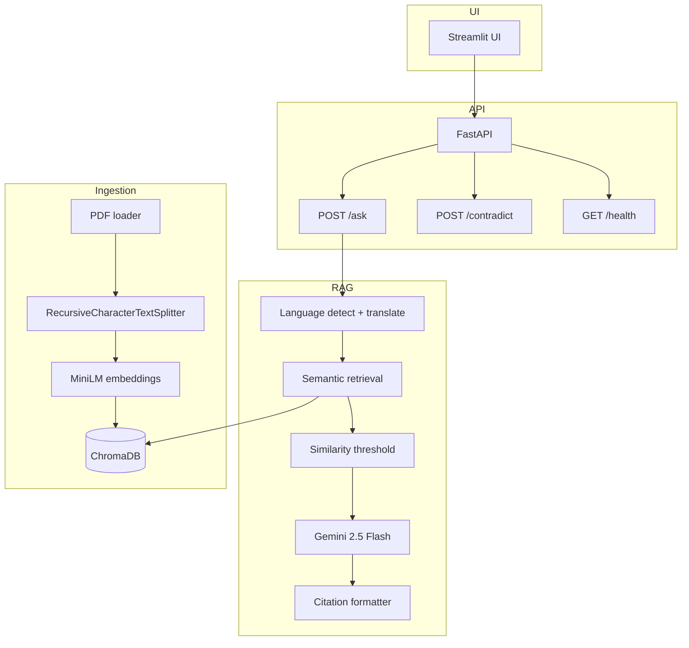

# potens-intern-aiml-techiekrish

**Document Q&A with Citations** — A focused, production-aware RAG system for the Potens IT Services AI/ML Engineer Internship take-home.

> *Built for reliability, grounded answers, and retrieval transparency — not feature breadth.*

---

## Project Overview

This project implements a trustworthy retrieval-augmented generation (RAG) pipeline over company policy documents. It answers multilingual questions with explicit citations, refuses unsupported queries, exposes retrieval debugging data, and compares documents for topic-level contradictions.

**Design intent:** Demonstrate engineering judgment under realistic time constraints — not maximum AI complexity.

---

## Features

- PDF ingestion with overlapping recursive chunking
- Persistent semantic search (ChromaDB + multilingual MiniLM embeddings)
- Grounded answers via Gemini 2.5 Flash with strict context-only prompts
- Citation format: `[Source: file.pdf | Page N | Chunk id]` + snippet
- Similarity thresholding to reduce hallucinations
- Multilingual Q&A: English and Hindi
- Contradiction analysis across two documents on a topic
- FastAPI backend + professional Streamlit UI
- Retrieval debug panel (chunks, scores, sources)
- Evaluation dataset (10 Q&A pairs) with metrics script
- Structured logging

---

## Architecture



---

## Folder Structure

```
project-root/
├── app/
│   ├── api/              # FastAPI routes & schemas
│   ├── rag/              # Embeddings, ChromaDB, retrieval
│   ├── ingestion/        # PDF load, chunking, pipeline
│   ├── evaluation/       # Dataset & eval script
│   ├── prompts/          # Grounded & contradiction prompts
│   ├── utils/            # Config, logging, citations
│   └── services/         # QA, LLM, language, contradiction
├── documents/            # PDF source documents
├── chroma_db/            # Persistent vector store (gitignored data)
├── streamlit_app/        # Streamlit UI
├── scripts/              # Sample PDF generator
├── tests/
├── examples/
├── main.py               # FastAPI entry
├── requirements.txt
├── .env.example
├── AI_USE_LOG.md
└── README.md
```

---

## Setup Instructions

**Prerequisites:** Python 3.10+, Gemini API key ([Google AI Studio](https://aistudio.google.com/apikey))

```bash
# 1. Clone
git clone https://github.com/<your-username>/potens-intern-aiml-techiekrish.git
cd potens-intern-aiml-techiekrish

# 2. Virtual environment
python -m venv .venv
# Windows
.venv\Scripts\activate
# macOS/Linux
source .venv/bin/activate

# 3. Dependencies (see note below if install seems stuck)
pip install "torch>=2.2.0,<2.13" --index-url https://download.pytorch.org/whl/cpu
pip install -r requirements.txt

# 4. Environment
copy .env.example .env   # Windows
# cp .env.example .env   # macOS/Linux
# Edit .env and set GEMINI_API_KEY=...

# 5. Generate sample documents (6 PDFs)
python scripts/generate_sample_documents.py

# 6. Start API (ingests PDFs on first run if store is empty)
python main.py

# 7. Start UI (new terminal)
streamlit run streamlit_app/app.py
```

**Expected setup time:** ~5–10 minutes (excluding first-time embedding model download ~400MB).

### Troubleshooting (Windows)

**`pip install` looks stuck at “Installing collected packages: … torch … chromadb …”**

This is usually **not a freeze**. Pip prints one line for the whole batch while it extracts very large wheels (`torch` ~120MB+, `scipy`, `pyarrow`, `onnxruntime`). On Windows with antivirus scanning, that phase often takes **10–20+ minutes** with no further output. Use the two-step install above, or run `.\scripts\run_setup.ps1`, and wait until you see `Successfully installed`.

If you see an `access violation` when importing ChromaDB/ONNX, use a **fresh virtual environment** with Python 3.10 or 3.11:

```bash
python -m venv .venv
.venv\Scripts\activate
pip install "torch>=2.2.0,<2.13" --index-url https://download.pytorch.org/whl/cpu
pip install -r requirements.txt
```

If issues persist, run the project under **WSL2** (recommended for Chroma + PyTorch stacks on Windows).

---

## API Endpoints

### `GET /health`

```json
{
  "status": "ok",
  "vector_store_chunks": 42,
  "documents_dir": "documents"
}
```

### `POST /ask`

**Request:**
```json
{ "question": "How many days of annual leave are provided?" }
```

**Response:**
```json
{
  "answer": "...",
  "citations": [
    {
      "label": "[Source: leave_policy.pdf | Page 1 | Chunk abc_3]",
      "source_file": "leave_policy.pdf",
      "page_number": "1",
      "chunk_id": "abc_3",
      "snippet": "Full-time employees receive twenty (20) days..."
    }
  ],
  "confidence_score": 0.72,
  "retrieved_chunks": [...]
}
```

### `POST /contradict`

**Request:**
```json
{
  "document_1": "leave_policy.pdf",
  "document_2": "hr_handbook_excerpt.pdf",
  "topic": "annual leave entitlement"
}
```

**Response:**
```json
{
  "conflict": true,
  "reasoning": "Document A states 20 days while Document B states 18 days...",
  "evidence": [...]
}
```

### `POST /ingest` / `POST /ingest/upload`

Re-index all PDFs or upload a new PDF.

---

## Technology Choices

| Component | Choice | Why |
|-----------|--------|-----|
| Vector DB | **ChromaDB** | Lightweight persistent storage, minimal setup, metadata-friendly citations |
| LLM | **Gemini 2.5 Flash** | Fast, strong multilingual quality, accessible free tier |
| Embeddings | **paraphrase-multilingual-MiniLM-L12-v2** | Local, efficient, cross-lingual semantic search |
| Chunking | **RecursiveCharacterTextSplitter** | Preserves semantic boundaries better than fixed splits |
| Backend | **FastAPI** | Typed APIs, fast to build, easy to test |
| UI | **Streamlit** | Rapid professional UI without frontend boilerplate |

---

## Chunking Strategy

| Parameter | Value | Rationale |
|-----------|-------|-----------|
| `chunk_size` | 800 | Large enough for policy context, small enough for precise citations |
| `chunk_overlap` | 150 | ~19% overlap preserves sentences split at boundaries |

**Why this matters:**
- **Semantic continuity** — overlapping chunks reduce information loss at split points
- **Retrieval quality** — right-sized chunks improve embedding match specificity
- **Citation precision** — smaller evidence units map cleanly to page + chunk metadata
- **Context preservation** — recursive separators respect paragraphs and sentences

---

## Retrieval Strategy

1. Detect query language → translate to English for retrieval (translation boundary)
2. Embed query with multilingual MiniLM (cosine similarity in ChromaDB)
3. Retrieve top-k=5 chunks with full metadata
4. Filter chunks below similarity threshold (default **0.45**)
5. Build numbered context block for the LLM
6. Generate grounded answer in the **original query language**

No reranking or hybrid BM25 — intentional simplicity for reliability within assignment scope.

---

## Hallucination Prevention

| Layer | Mechanism |
|-------|-----------|
| Retrieval | Similarity threshold drops weak evidence |
| Prompting | Strict context-only system instructions |
| Refusal | Standard insufficient-information message |
| Confidence | Heuristic from max similarity + support ratio |
| UI | Low-confidence warning + retrieval debug |

**Insufficient-information response:**
> *"The provided documents do not contain enough information to answer this question confidently."*

---

## Multilingual Support

**Supported:** English (`en`) and Hindi (`hi`)

**Approach (intentionally simple):**
1. Detect query language
2. Translate query to English for retrieval
3. Generate answer in the original language

This translation-boundary approach was chosen for **reliability and simplicity** within assignment time constraints. Multilingual embeddings still help, but English retrieval queries improve consistency for policy-style documents primarily written in English.

**Uploaded PDFs (e.g. `Potens_Intern_Take_Home_2026.pdf`):** These are text-based, not scanned images — OCR is usually **not** required. Many exports still break each word onto a new line; the ingestion pipeline normalizes whitespace before chunking. After adding or replacing a PDF, **re-ingest** (`POST /ingest` or restart `main.py` on an empty store) so chunks are rebuilt.

### PDF ingestion and retrieval fixes (May 2026)

We improved answer quality on uploaded assignment PDFs (e.g. `Potens_Intern_Take_Home_2026.pdf`) and policy docs:

| Change | File(s) | Why |
|--------|---------|-----|
| **Whitespace normalization** after `pypdf` extract | `app/ingestion/pdf_loader.py` | Word-per-line PDF exports produced unusable chunks and weak embeddings |
| **Document/page prefix on each chunk** | `app/ingestion/chunker.py` | Helps semantic search match questions that refer to a file or section |
| **Borderline retrieval fallback** (top 3 chunks if best similarity ≥ 0.35) | `app/services/qa_service.py` | Stops valid but slightly low-scoring chunks from triggering a refusal |
| **English + Hindi only** (removed Gujarati/Marathi) | `app/services/language.py`, UI, tests | Focus on `en` / `hi` per project scope |
| **Longer, sectioned sample PDFs + real Hindi notice** | `scripts/generate_sample_documents.py`, `documents/*.pdf` | More realistic policy text; Devanagari in `multilingual_notice.pdf` |
| **Pinned heavy deps + staged Windows install** | `requirements.txt`, `scripts/run_setup.ps1` | Faster, more reliable `pip install` on Windows |

**After pulling these changes:** restart `python main.py` and run **Re-ingest all documents** (or `POST /ingest`) so ChromaDB is rebuilt with normalized text—not just restart without re-ingest.

**Wrong answers are usually not the LLM ignoring the PDF**—check the Streamlit retrieval debug panel first (similarity scores and chunk previews). Common causes: stale index, broken PDF layout before normalization, or conflicting numbers across docs (e.g. 20 vs 18 annual leave days in `leave_policy.pdf` vs `hr_handbook_excerpt.pdf`).

---

## Evaluation Strategy

Dataset: `app/evaluation/eval_dataset.json` (10 questions)

Run:
```bash
python -m app.evaluation.run_eval
```

**Metrics:**
- Retrieval hit rate (@top-5, expected source present)
- Keyword match rate in grounded answers
- Tracked refusals for out-of-corpus questions

Results saved to `app/evaluation/eval_results.json`.

---

## Tradeoffs

| Decision | Benefit | Cost |
|----------|---------|------|
| No reranking | Faster, simpler pipeline | Slightly lower precision on ambiguous queries |
| No hybrid BM25 | Less infrastructure | Weaker exact keyword matching |
| Translation for retrieval | Consistent English retrieval | Boundary errors for non-English docs |
| Heuristic confidence | Transparent, debuggable | Not calibrated probability |
| Local embeddings | No API cost, privacy | Cold-start model download |
| ChromaDB local | Zero DevOps | Not horizontally scalable |

---

## Limitations

- **No OCR** — scanned PDFs without text layers will not ingest correctly
- **Contradiction detection** may miss implicit or nuanced semantic conflicts
- **Confidence score** is heuristic, not a statistical calibration
- **Multilingual quality** depends on translation and LLM fluency
- **PDF extraction** quality varies by PDF generator (sample docs use FPDF text layers)
- **Internet required** for Gemini API and Google Translate (deep-translator)

---

## Future Improvements

*(Not implemented — documented for roadmap clarity)*

- Cross-encoder reranking
- Hybrid BM25 + vector retrieval
- OCR for scanned documents
- pgvector / managed vector DB for production scale
- Streaming LLM responses
- Authentication and multi-tenant isolation
- Cloud deployment with observability (latency, cost, retrieval metrics)

---

## Testing

```bash
pytest tests/ -v
```

Covers: chunking metadata, citations, retrieval threshold, multilingual helpers, API health, refusal constants.

---

## Logging

Logs include: incoming queries, retrieval scores, chunk counts, LLM latency, and errors.

Configure via `LOG_LEVEL` in `.env` (default: `INFO`).

---

## Suggested Commit History

Use meaningful incremental commits:

```
initialize fastapi project structure
implement pdf ingestion pipeline
add chunk metadata preservation
integrate chromadb semantic retrieval
implement grounded answer prompting
add citation formatting system
implement multilingual translation flow
build streamlit retrieval debugging interface
add evaluation dataset and metrics
document architecture tradeoffs in README
```

---

## AI Use Log

See [AI_USE_LOG.md](AI_USE_LOG.md) for tool usage transparency.

---

## Author

Krish Shah — Potens IT Services AI/ML Engineer Internship Take-Home
